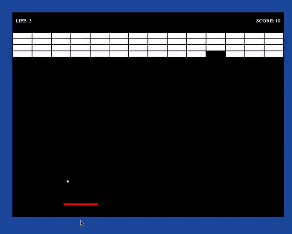

# Atari-Brakeout-Game

I developed "Brakeout", one of the legendary Arcade games! 
### How can you play? ###
Just run the index.html file with your browser.

### Rules ###
* The stick moves with the mouse and the left-right arrow keys.
* The speed of the ball change according to the angle of hit.
* The game has to start after pressing the start button.
* You have 3 lives. The game will end when the lives are over.

